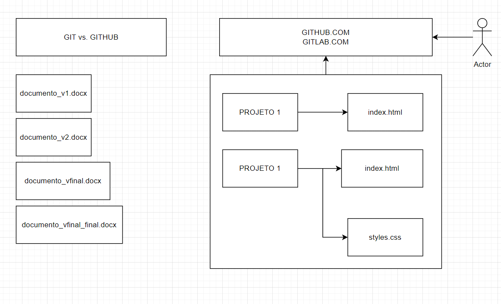
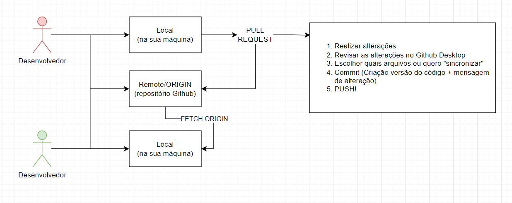
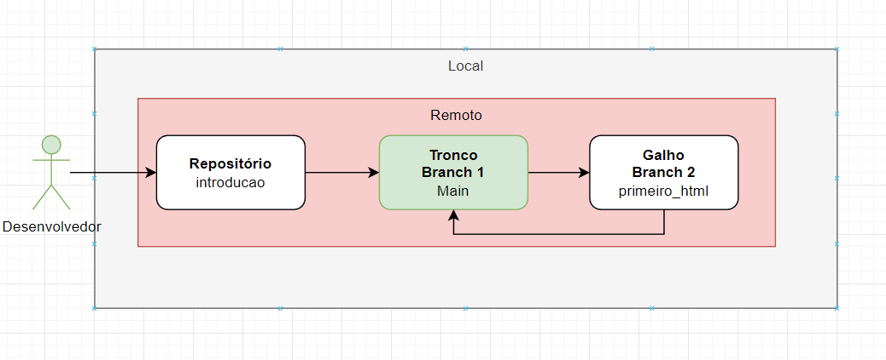

# Primeira Atividade 15/07/2022

1. Abrir uma branch local a partir da `main`;
2. Criar uma pasta dentro da atual `Aula 1` com seu nome e criar um arquivo HTML (nome_do_desenvolvedor.html);
3. Publicação da sua branch e commit(s) no Github
4. Abrir Pull Request no Github para a `main`

## Material de apoio:

### Git vs Github

### Local vs Remoto

### Branches (Galhos)

